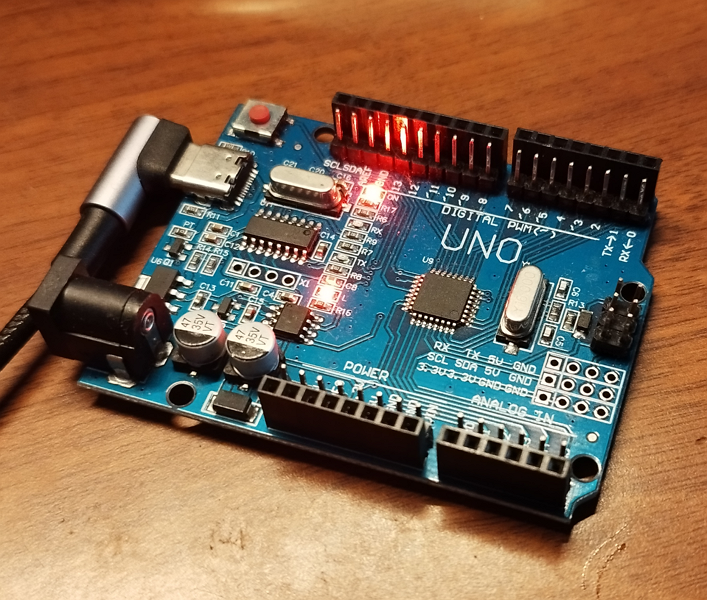

# ATmega avr-gcc Project Template

[](https://github.com/agfaps/atmega-cmake-avrgcc/actions/workflows/avr-ci.yml)

This project demonstrates simple project configuration for ATmega328P in an arduino board.  
It include simple built-in LED blinking example using avr-gcc, cmake, make, avrdude, and built-in arduino bootloader.

<p align="center">
  
</p>

## Required Tools

At minimum, we need `gcc, avr-gcc, make, cmake, and avrdude` installed.

### Windows

For Windows, you can use `choco` (Administrator required) to install `make, cmake, and avrdude`.
To install `avr-gcc` you can use `scoop` package manager.

`choco`:
```sh
choco install make cmake avrdude
```

If you want to install `gcc` using `choco`, the package name is `mingw`.

`scoop`:
```sh
scoop install avr-gcc gcc
```

### Ubuntu

```sh
sudo apt install make cmake avrdude gcc-avr build-essential -y
```

### MacOS

Not tested yet.

Check additional [documentation](docs/VSCodeSetup.md) when needing information such as setting up an IDE, etc.


## AVR CMake Setup

Change COM port name in CMakeLists.txt in your OS.

```sh
set(AVRDUDE_COM_PORT COM8)
set(AVRDUDE_COM_PORT /dev/ttyUSB0)
```

Run setup script.

```sh
sh setup_cmake.sh
```

## Build and flash

Compile, detect chip type, and flash.

```sh
make all
make detect
make flash
```

## Building Unit Tests

### Unity

Steps to build Unity test (from `${workspaceFolder}`):
```sh
cd test/unity
mkdir build
cd build
cmake -G "Unix Makefiles" ..
make all
./run_tests(.exe)
```

### CppUTest

Steps to build CppUTest test (from `${workspaceFolder}`):
```sh
cd test/cpputest
mkdir build
cd build
cmake -G "Unix Makefiles" ..
make all
./run_tests(.exe)
```

### GoogleTest

Steps to build GoogleTest test (from `${workspaceFolder}`):
```sh
cd test/googletest
mkdir build
cd build
cmake -G "Unix Makefiles" ..
make all
./run_tests(.exe)
```

### Catch2

Steps to build Catch2 test (from `${workspaceFolder}`):
```sh
cd test/catch2
mkdir build
cd build
cmake -G "Unix Makefiles" ..
make all
./run_tests(.exe)
```

## Dockerfile

If you just want to use docker image and do not want to install the required tools (at least having docker desktop installed and running),  
you can just build the image locally.

Here are the steps:  
Execute from root repo  

`docker build -t avr-firmware -f docker/Dockerfile .`

After docker image has been created, to build avr firmware (Windows, mingw):  

`docker run --rm -v "$(pwd -W):/project" avr-firmware build`

Ubuntu(not tested):

`docker run --rm -v "$(pwd):/project" avr-firmware build`

## License

This project is licensed under the MIT License - see the [LICENSE](./LICENCE) file for details.
